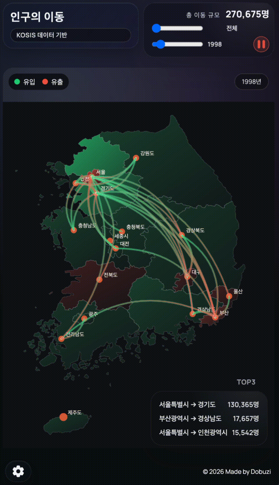
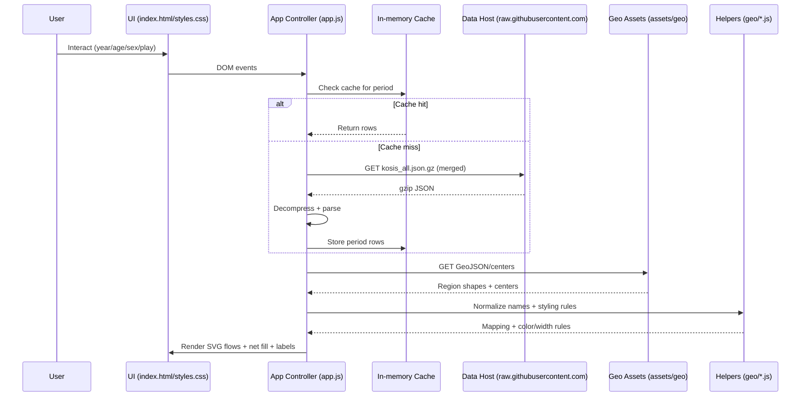

# Demographics: Population Flow Map

## Overview
- Web infographic for Korea migration flows using KOSIS yearly/monthly datasets.
- Single combined map shows flow lines plus net inflow/outflow fill on the same SVG.
- UI includes controls, summary stats, top flows, and legends in a no-scroll layout.

[Live Demo](https://dobuzi.github.io/demographics/)

## Architecture

## Project Structure
- `index.html`, `styles.css`, `app.js` — main web app.
- `assets/geo/` — GeoJSON boundaries and office center coordinates.
- `geo/` — mapping utilities and styling helpers.
- `data/` — local KOSIS downloads and merged output (gitignored).
- `tests/` — Node-based tests (`*.test.js`).

## Development
### Run locally
- `python3 -m http.server 8000`

### Tests
- `node tests/layout.test.js` (or any file in `tests/`)

## Data Notes
- GeoJSON: `assets/geo/korea_sido.geojson`
- Office centers: `assets/geo/sido_office_centers.json`
- Yearly downloads: `data/kosis_yearly/`
- Hosted data: upload `kosis_all.json.gz` to a separate public data repo (e.g.,
  `Dobuzi/demographics-data`) and keep `window.KOSIS_DATA_BASE_URL` pointing to
  `https://raw.githubusercontent.com/<owner>/<repo>/main`.

## Roadmap
1. Verify hover interactions and line/tooltips across datasets.
2. Validate data loader against yearly and merged datasets.

## License
MIT License. See `LICENSE`.

# Development Guidelines

## Test-First Policy
- When code changes are required, write or update tests first.
- Modify implementation only after tests are in place.
- Run the relevant test suite after every change and confirm it passes.
